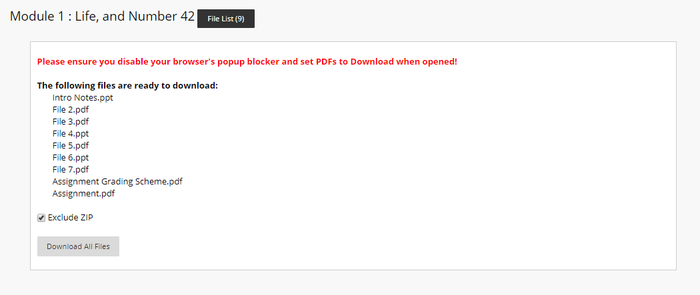

# What is this?
**Blackboard Download Helper** is a user script that allows you to download multiple files from Blackboard Learn.

It conveniently adds a File List button and allows you to download all files from the Course Documents page being viewed. Note that you will have to disable your popup blocker and explicitly set Chrome to download PDFs instead of opening them with a supported viewer.

**Compatible with:** Tampermonkey, Greasemonkey

**Tested on:** Chrome 75

**Tested on Blackboard for:** Nanyang Technological University (NTU), Singapore

Licensed under **GNU GPLv3**. Refer to LICENSE file included.